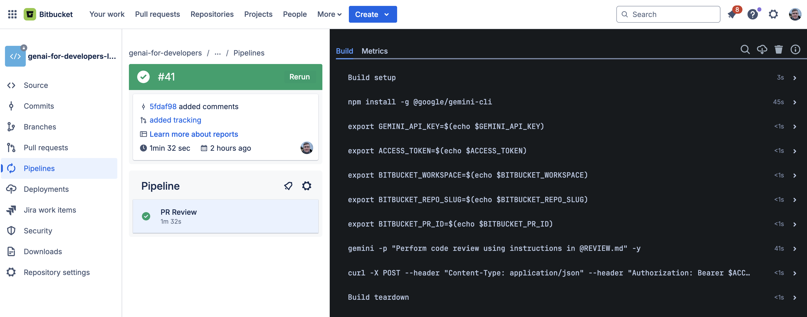
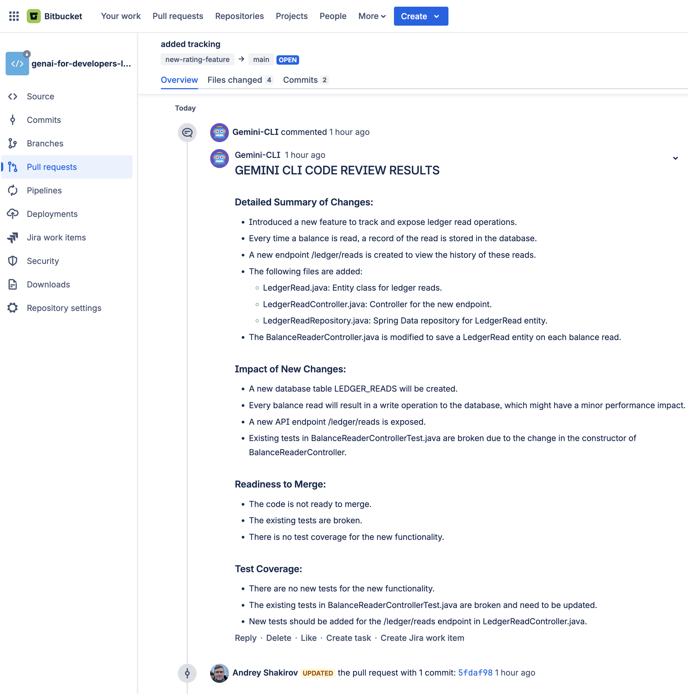

# Bitbucket PR Reviews with Gemini CLI

This repository demonstrates how to use the Gemini CLI to automatically review Bitbucket pull requests.

## Overview

The process works as follows:

1.  A pull request is created in Bitbucket.
2.  A Bitbucket Pipeline is triggered by the pull request.
3.  The pipeline installs the Gemini CLI.
4.  The Gemini CLI is used to perform a code review, following the instructions in the `REVIEW.md` file.
5.  The code review is posted as a comment on the pull request.

## Files

*   `bitbucket-pipelines.yml`: This file defines the Bitbucket Pipeline that automates the code review process.
*   `REVIEW.md`: This file contains the instructions for the Gemini CLI to perform the code review. It specifies that the CLI should run a git diff, review the changes, and then format the output as a JSON payload with a detailed summary of the changes, the impact of the new changes, readiness to merge, test coverage, and a security review.
*   `README.md`: This file (the one you're reading right now).

## Setup

1.  **Add Environment Variables to your Bitbucket repository:**
    *   `GEMINI_API_KEY`: Your Gemini API key. Needs to be configured in Bitbucket repository settings under "Repository variables". **For Enterprise users, configure GOOGLE_API_KEY instead. Details [here](https://github.com/google-gemini/gemini-cli/tree/main?tab=readme-ov-file#option-3-vertex-ai).**
    *   `ACCESS_TOKEN`: Your Bitbucket access token with permissions to comment on pull requests(PR Write). Needs to be configured in Bitbucket repository settings under "Repository variables".
    *   `BITBUCKET_WORKSPACE`: The workspace where your repository is located. Runtime variable provided by Bitbucket Pipelines.
    *   `BITBUCKET_REPO_slug`: The slug of your repository. Runtime variable provided by Bitbucket Pipelines.
    *   `BITBUCKET_PR_ID`: The ID of the pull request. This is automatically set by Bitbucket Pipelines.
2.  **Enable Bitbucket Pipelines:** If you haven't already, enable Bitbucket Pipelines in your repository settings.

Once you've completed the setup, any new pull requests will be automatically reviewed by the Gemini CLI.

## Example

Here is an example of the pipeline in action:

And here is an example of the code review summary posted as a comment on the pull request:

